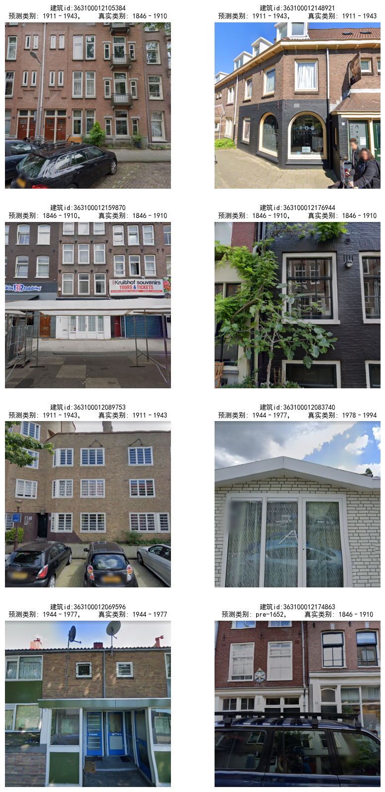

# 论文复现——《通过深度学习来识别建筑年代和风格》

📌建议先阅读[论文解读：如何利用最近很火的深度学习来识别建筑年代和风格？🔗](https://blog.renhai.online/archives/Understanding_architecture_age_and_style_through_deep_learning_part1)以了解论文的大致内容和技术方法

📌所有文章均可在[我的博客](https://blog.renhai.online)和[微信公众号（renhai-lab）](assets/qrcode_for_gh_c0d228771707_258.jpg)中找到，欢迎关注！

📌 收录进微信公众号专栏：[【SCI论文复现】《通过深度学习了解建筑年代和风格》](https://mp.weixin.qq.com/mp/appmsgalbum?__biz=MzkwNjQyNjA4OQ==&action=getalbum&album_id=3161638624223559681#wechat_redirect)

> 《通过深度学习了解建筑年代和风格》论文复现代码已上传到[Github](https://github.com/renhai-lab/Paper_Replication--Understanding-architecture-age-and-style-through-deep-learning)和[Gitee](https://gitee.com/renhai-lab/Paper_Replication--Understanding-architecture-age-and-style-through-deep-learning)，但Gitee仅用于同步，目前文章和仓库还在更新中，请访问对应的主页查看。

## 一、文章目录

| 状态 | 文章标题                                                     | 博客                                                         | 微信文章                                                     |
| ---- | ------------------------------------------------------------ | ------------------------------------------------------------ | ------------------------------------------------------------ |
| 🟠    | Part1.论文解读：如何利用最近很火的深度学习来识别建筑年代和风格？ | [博客🔗](https://blog.renhai.online/archives/Understanding_architecture_age_and_style_through_deep_learning_part1) | [微信🔗](https://mp.weixin.qq.com/s?__biz=MzkwNjQyNjA4OQ==&mid=2247486261&idx=1&sn=0e65b3228c35b57cf5de17defd175df5&chksm=c0e9e8b3f79e61a58d74ac409e31f3b64706eceefd4b439499287ef1657ea1f372867e6871e0#rd) |
| 🟠    | Part2.下载和预处理建筑足迹数据集                             | [博客🔗](https://blog.renhai.online/archives/Understanding_architecture_age_and_style_through_deep_learning_part2) | [微信🔗](https://mp.weixin.qq.com/s?__biz=MzkwNjQyNjA4OQ==&mid=2247486308&idx=1&sn=954169acd58d01a22bcfc7c3d28fbfd7&chksm=c0e9e8e2f79e61f4db91e63954fc13cff5aae6fd9dff720b5d7f6587413a92eedac19ff11d02#rd) |
| 🟠    | Part3-1.获取高质量的阿姆斯特丹建筑立面图像                   | [博客🔗](https://blog.renhai.online/archives/Understanding_architecture_age_and_style_through_deep_learning_part3-1) | [微信🔗](https://mp.weixin.qq.com/s?__biz=MzkwNjQyNjA4OQ==&mid=2247486379&idx=1&sn=ba562c4597fbe35d060da00a6732a8fd&chksm=c0e9e82df79e613b27bd20cb99a5b7d57f2c96739b6a5a9aed1f378d07311dc0afa6a88a7431#rd) |
| 🟠    | Part3-2.获取高质量的阿姆斯特丹建筑立面图像                   | [博客🔗](https://blog.renhai.online/archives/Understanding_architecture_age_and_style_through_deep_learning_part3-2) | [微信🔗](https://mp.weixin.qq.com/s?__biz=MzkwNjQyNjA4OQ==&mid=2247487438&idx=1&sn=46584f8aae5cce92d63cdc12df574a20&chksm=c0e9ec48f79e655e90f8704bdd99f6d39fe0778f02f50b860a303d09f6a32017a4fe47bc6895#rd) |
| 🟠    | Part4-1.对建筑年代进行深度学习训练和预测                     | [博客🔗](https://blog.renhai.online/archives/Understanding_architecture_age_and_style_through_deep_learning_part4-1) | [微信🔗](https://mp.weixin.qq.com/s?__biz=MzkwNjQyNjA4OQ==&mid=2247487284&idx=1&sn=46e152ea7f69d51d76b10dfe6e5d577e&chksm=c0e9ecb2f79e65a4fe4db6d316d45a730c483a54ba5b641eb69cd8395146d113e19805b0fa90#rd) |
| 🟠    | Part4-2.对建筑年代预测结果进行展示和分析                     | [博客🔗](https://blog.renhai.online/archives/Understanding_architecture_age_and_style_through_deep_learning_part4-2) | [微信🔗](https://mp.weixin.qq.com/s?__biz=MzkwNjQyNjA4OQ==&mid=2247487319&idx=1&sn=6567c74123e57cd7ab4a88a8f3b6683d&chksm=c0e9ecd1f79e65c7e3671de13e86f4d7d37e8c027662961c1d93f5963d3abc964d9c78740ad1#rd) |
| 😑    | 练习：Part5.对建筑风格进行深度学习训练和预测以及分析         |                                                              |                                                              |

## 二、使用说明

**fork 本仓库，然后克隆到本地或者用云端编辑器打开，最后安装环境。**

## 三、环境配置说明

1. 直接安装Python、或者使用Anaconda、Pycharm、VScode安装。
2. pytorch推荐单独安装，详见[PyTorch环境配置](https://blog.renhai.online/archives/DL-01-pytorch#2.PyTorch%E7%8E%AF%E5%A2%83%E9%85%8D%E7%BD%AE)。
3. 其余依赖使用`pip install requirements.txt`。

## 四、部分成果

⬇️阿姆斯特丹的建筑足迹


⬇️阿姆斯特丹的道路线数据Amsterdam_road.edges

⬇️originl image和pred_color的对比


⬇️模型预测可视化结果



⬇️ 表 4 混淆矩阵（百分比）


⬇️ 图 10 CAM去识别不同年代模型的关注点


1. *左侧小图是将CAM 叠加在原始图像上。图像的红色区域主要覆盖一楼和二楼之间的窗户或门。*
2. *右侧小图：根据 CAM 裁剪的图像显示了窗户的演变。早期的窗户通常框架较宽，装饰较多，而且较窄。最近的窗户样式以方形和水平形状为特点，框架更薄，装饰更少，深度更小。*

⬇️ 图7  阿姆斯特丹市中心建筑年代预测结果空间分布

蓝色表示旧建筑被预测为新建筑，而粉色表示模型将新建筑预测为旧建筑。灰色表示预测正确。

⬇️图8 ：建筑年代预测结果在150米网格范围的准确度


## 五、数据集

### 1.原始数据源

> 数据源的获取会在下一篇文章[《获取数据集——《通过深度学习了解建筑年代和风格》论文复现（二）》](https://blog.renhai.online/archives/Understanding_architecture_age_and_style_through_deep_learning_part2)详细说明。

- [BAG建筑足迹](https://service.pdok.nl/lv/bag/atom/bag.xml)——用于获取建筑的几何数据以及建筑年代数据

- [剑桥大学建筑风格图集和相应数据](https://www.dropbox.com/sh/cz4xs1jeqm9y4bw/AACEiAWQDqhGqa6PzHgFXMuKa?dl=0)

- [基于PyTorch的MIT ADE 20 K数据集语义分割](https://github.com/CSAILVision/semantic-segmentation-pytorch)


### 2.（备用）国内阿里云盘下载链接：
**《使用深度学习识别建筑年代和风格》项目数据集，需要手动快传分享给你，可以关注公众号：【renhailab】发送【20240401】获取，** 
内容包含：
- **筛选后的阿姆斯特丹街景图片** 
- **剑桥建筑风格数据集**           
- **阿姆斯特丹大都市区的建筑足迹**
- **5-ArcgisPro工程**
- **ckpt**： /3-selenium获取街景并进一步筛选街景图像/ckpt/
- **models**： /4.1-对建筑年代进行深度学习训练和预测/models/weights_6/

### 3.（备用）国内百度网盘下载链接：

- BAG建筑足迹：https://pan.baidu.com/s/1ugy2r8tvO6kbqUTxZWTsUA?pwd=216f 
  提取码：216f
- 剑桥大学建筑风格图集和相应数据：https://pan.baidu.com/s/1L4uBNvZvNr0oWdjpwAuwBw?pwd=c3bg 
  提取码：c3bg


## 六、仓库主要代码文件的结构

```
├── 1-论文阅读和解析
│   ├── Understanding architecture age and style through deep learning.pdf
│   └── 论文双语版：通过深度学习了解建筑时代和风格 - ScienceDirect.html
├── 2-获取数据集
│   ├── notebook
│   │   ├── 2.1-BAG建筑足迹数据预处理.ipynb
│   │   ├── 2.2-osmnx获取道路数据.ipynb
│   │   └── 2.3-通过streetview获取含有谷歌街景地图的网页url.ipynb
│   └── script
│       ├── 2.1-使用geopandas寻找街景点.py
│       └── 2.2-通过streetview获取含有url的csv文件.py
├── 3-selenium获取街景并进一步筛选街景图像
│   ├── ckpt
│   │   └── ade20k-resnet50dilated-ppm_deepsup
│   ├── notebook
│   │   ├── 3.1-2-删除损坏的文件.ipynb
│   │   ├── 3.1-selenium获取街景截图.ipynb
│   │   └── 3.2-语义分割预筛选街景照片..ipynb
│   ├── script
│   │   ├── 3.1-selenium多线程获取街景.py
│   │   └── 3.2-语义分割筛选街景完整代码.py
├── 4.1-对建筑年代进行深度学习训练和预测
│   ├── notebook
│   │   ├── 4.1.1-建筑年代的模型选择和训练.ipynb
│   │   ├── 4.1.2-对训练集进行预测并保存结果.ipynb
│   │   ├── 4.1.3-建筑年代模型评价.ipynb
│   │   ├── 4.1.4-制作建筑年代预测结果的空间分布图.ipynb
│   │   ├── 4.1.5-使用ArcGIS-Pro和Arcy制作建筑年代预测结果在150米精度范围的准确度.ipynb
│   │   ├── 4.1.6-计算空间自相关(莫兰指数).ipynb
│   │   ├── 4.1.7-探讨建筑年龄和建筑风格的关系.ipynb
│   ├── script
│   │   ├── TS.py
│   │   ├── engine.py
│   │   └── train.py
├── 4.2-对建筑风格进行深度学习训练和预测
│   ├── notebook
│   │   ├── 4.2.2-建筑风格模型评价.ipynb
├── 5-ArcgisPro工程
│   ├── 1.使用ArcPy简化和拆分建筑.py
│   ├── 2.使用ArcPy寻找街景点.py
│   └──  通过深度学习了解建筑风格和年代.ppkx
├── README.md
├── my_tools
│   ├── engine.py
│   ├── helper_functions.py
│   ├── validate_image.py
│   ├── 合并多个csv文件.py
│   └── 缩小街景图像.ipynb
└── requirements.txt
```

## 引用信息 (Cite info)

Maoran Sun, Fan Zhang, Fabio Duarte, Carlo Ratti,
Understanding architecture age and style through deep learning,
Cities,
Volume 128,
2022,
103787,
ISSN 0264-2751,
https://doi.org/10.1016/j.cities.2022.103787.
(https://www.sciencedirect.com/science/article/pii/S0264275122002268)
Abstract: Architectural styles and their evolution are central to architecture history. However, traditional approaches to understand styles and their evolution require domain expertise, fieldwork and extensive manual processes. Recent research in deep learning and computer vision has highlighted the great potential in analyzing urban environments from images. In this paper, we propose a deep learning-based framework for understanding architectural styles and age epochs by deciphering building façades based on street-level imagery. The framework is composed of two stages: Deep ‘Learning’ the architecture and Deep ‘Interpreting’ the architecture age epochs and styles. In Deep ‘Learning’, a deep convolutional neural network (DCNN) model is designed to automatically learn about the age characteristics of building façades from street view images. In Deep ‘Interpreting’ stage, three components are proposed to understand the different perspectives regarding building ages and styles. In the experiment, a building age epoch dataset is compiled for the city of Amsterdam and Stockholm to understand the evolution of architectural element styles and the relationship between building ages and styles spatially and temporally. This research illustrates how publicly available data and deep learning could be used to trace the evolution of architectural styles in the spatial-temporal domain.
Keywords: Building age; Architectural style; Street view imagery; Built environment; Deep learning

---

因为其他平台不能同步修改，论文解读文章将最先在[我的博客](https://blog.renhai.online)发布，你可以点击[阅读原文](https://blog.renhai.online/categories/Paper_Replication)查看本专题的所有文章。

如果你觉得本系列文章有用，欢迎关注博客，点赞👍和收藏，也欢迎在评论区讨论，有任何问题都可以私信我：

- [我的博客](https://blog.renhai.online/)
- [我的GITHUB](https://github.com/renhai-lab)
- [我的GITEE](https://gitee.com/renhai-lab)
- [我的知乎](https://www.zhihu.com/people/Ing_ideas)
- **微信公众号：**


